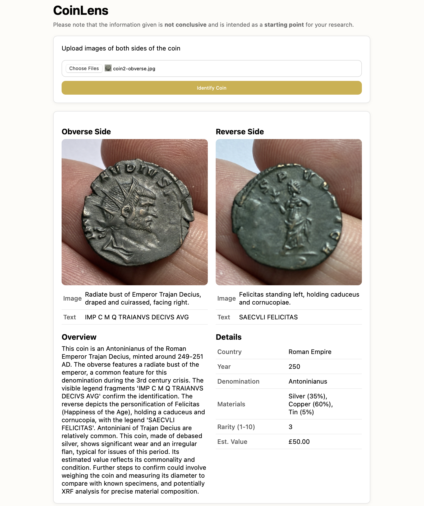

# CoinLens

CoinLens is a simple web app that analyses coin images using an LLM. Information about the coin is returned and presented to the user. While this information is not conclusive, it does give a good starting point when researching an unknown coin.

> **Note:** This app depends on the Google Gemini API, which may occasionally return 503 errors under load.

<p align="center">
    
</p>

## Example Coins

Within the repository are images of 5 example coins. These were all found on eBay.

1) Elizabeth II 1965 Winston Churchill Crown Coin - £2
2) Henry VIII Hammered Groat Facing Portrait Tower 1544-47 Coin WRL Westair - £10
3) 1917 King George V Half Penny Coin - £1.80
4) Solid Silver 1oz Canadian Maple Leaf 2017 Five Dollars Bullion Coin .9999 Silver - £84
5) Roman imperial coin, Claudius II, 268-270 Antonianus - £15

## Run with Docker

```bash
docker build -t coinlens .
docker run -p 8000:8000 -e GEMINI_API_KEY='INSERT_KEY_HERE' coinlens
```

Then open http://localhost:8000 in a web browser.

## Run Without Docker

Create and activate a virtual environment
```bash
python3.12 -m venv venv
source venv/bin/activate
```

Install dependencies
```bash
pip install -r requirements.txt
```

Add the environment variable
```bash
export GEMINI_API_KEY='INSERT_KEY_HERE'
```

Run the backend application
```bash
fastapi run main.py
```

Then open http://localhost:8000 in a web browser.

## Further Improvements

Features:
- Upload/Capture Images on Mobile
- Image Field Preview
- Download Coin Report PDF/JSON/CSV

Quality of Life:
- Display Errors
- 503 "Service Temporarily Unavailable" Retry Button

Optimisations:
- Local backup model
- Minimise token usage
- Prompt Engineer to improve accuracy

## Potential V2

A more complex version of this app is possible. It would include user accounts, each with a coin collection. They can upload images of new coins for analysis and add them to their collection. Coin details can be manually edited so the user can correct inaccuracies when they research the coins further. They can see key insights such as the countries and eras included in their collection as well as the total value.

This version would likely utilise Django for its account management handling.